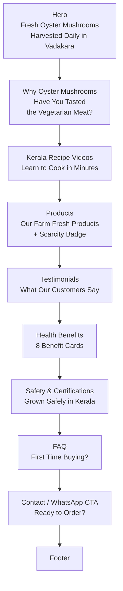

# Full Content Restructure Plan

Based on [`truth.md`](truth.md), here is the complete plan to restructure [`src/pages/index.astro`](src/pages/index.astro).

---

## Final Hierarchy (10 sections)

| Order | Section | Source Lines | Changes Required |
|-------|---------|-------------|------------------|
| 1 | **Hero** | [`truth.md:11-22`](truth.md) | Heading: "Fresh Oyster Mushrooms, Harvested Daily in Vadakara". Subtext: 'Taste the "Vegetarian Meat" — farm-fresh, delivered straight to your kitchen.' Keep `min-h-[80vh] pt-48 pb-4`. CTA: Order Fresh Now → `#store`, Watch Recipes → `#videos` |
| 2 | **Why Oyster Mushrooms** | [`truth.md:26-42`](truth.md) | Replace existing Hook/Value Proposition section. Remove scrolling marquee entirely. Replace with: Heading "Have You Tasted the 'Vegetarian Meat'?", intro paragraph about oyster vs button mushrooms, 4 clean icon cards (iceberg/fa-bolt Metabolism, fa-shield-alt Immunity, fa-brain Brain Power, fa-heart Heart Health). White/light background instead of primary red. Calm premium spacing. |
| 3 | **Kerala Recipe Videos** | [`truth.md:46-63`](truth.md) | Move from current position 6 to position 3. Keep heading "Learn to Cook in Minutes". Subtext: "Oyster mushrooms hold their shape and absorb Kerala curry flavours perfectly. Watch and cook today." Keep existing video grid + CTA. |
| 4 | **Products** | [`truth.md:68-89`](truth.md) | Move from current position 3 to position 4. Add scarcity badge: "Limited Daily Harvest — We harvest fresh every morning. Quantities are limited. Order early to avoid missing out." Keep existing "How It Works" steps, clean 3-column grid. |
| 5 | **Testimonials** | [`truth.md:93-102`](truth.md) | **NEW SECTION.** 3-4 customer quote cards with FontAwesome quote icons. Example quotes provided. |
| 6 | **Health Benefits** | [`truth.md:106-123`](truth.md) | Keep existing 8-card grid. Already matches truth.md precisely. |
| 7 | **Safety & Certifications** | [`truth.md:127-147`](truth.md) | Keep existing FSSAI/MSME badges. Reduce storage guide to compact table format. Keep handling tips compact. Move Why Choose Us to be embedded here (as currently done). |
| 8 | **FAQ** | [`truth.md:151-163`](truth.md) | Keep existing 4-question accordion. Already matches truth.md. |
| 9 | **Contact / WhatsApp CTA** | [`truth.md:168-183`](truth.md) | **NEW SECTION.** Full-width primary-colored CTA block before Footer: heading "Ready to Order?", subtext "Fresh harvest. Direct from farm. One WhatsApp message away.", Order on WhatsApp button, contact details (address, phone, email), business hours. |
| 10 | **Footer** | [`truth.md:188-193`](truth.md) | No changes needed to [`src/components/Footer.astro`](src/components/Footer.astro). |

---

## Removals

| Item | Location | Action |
|------|----------|--------|
| Scrolling "Superfood - Protein - Immunity - Energy" marquee | Old Hook section | **Remove entirely** |
| "Limited Daily Harvest" badge from Hook section | Old Hook section | **Move to Products section** as scarcity trigger |
| Hook section's primary red background | Old Hook section | **Replace** with white/light background |

---

## Data Flow

No changes needed to:
- [`src/data/products.ts`](src/data/products.ts)
- [`src/components/store/CartDrawer.astro`](src/components/store/CartDrawer.astro)
- [`src/components/store/ProductCard.astro`](src/components/store/ProductCard.astro)
- [`src/pages/products/[slug].astro`](src/pages/products/[slug].astro)
- [`public/js/site-ui.js`](public/js/site-ui.js)
- [`src/assets/css/styles.css`](src/assets/css/styles.css)

Only [`src/pages/index.astro`](src/pages/index.astro) needs restructuring.

---

## Execution Order

1. Rewrite frontmatter by adding a `testimonials` data array (3-4 objects with quote, name, area)
2. Rework Hero section copy + padding
3. Rewrite old Hook section as clean "Why Oyster Mushrooms" (remove marquee, white bg, premium spacing, no unicode emojis — use FontAwesome)
4. Move Videos section up from current position 6 to new position 3
5. Move Products section from current position 3 to new position 4 (add scarcity line)
6. Insert new Testimonials section at position 5
7. Keep Health Benefits at position 6 (already correct content)
8. Keep Safety + Why Choose Us at position 7
9. Keep FAQ at position 8
10. Insert new Contact/WhatsApp CTA at position 9
11. Keep Footer at position 10
12. Build and verify

---

## Icon Mapping (Unicode → FontAwesome)

| Unicode | FontAwesome | Section |
|---------|-------------|---------|
| 🔥 Metabolism | `fa-bolt` | Why Oyster Mushrooms |
| 🛡️ Immunity | `fa-shield-alt` | Why Oyster Mushrooms |
| 🧠 Brain Power | `fa-brain` | Why Oyster Mushrooms |
| ❤️ Heart Health | `fa-heart` | Why Oyster Mushrooms |
| 🟢 Fresh | `fa-seedling` color green | Products badge |
| 🟡 Dried | `fa-sun` color amber | Products badge |
| 🔴 Pickled | `fa-jar` color red | Products badge |
| ⏳ Scarcity | `fa-hourglass-half` | Products section |
| 🛡️ Immune | `fa-shield-virus` | Health Benefits |
| 💪 Protein | `fa-dumbbell` | Health Benefits |
| ☀️ Vitamin D | `fa-sun` | Health Benefits |
| ❤️ Heart | `fa-heart` | Health Benefits |
| 🧠 Brain | `fa-brain` | Health Benefits |
| 🌿 Gut Health | `fa-seedling` | Health Benefits |
| 🔥 Low-Cal | `fa-fire` | Health Benefits |
| ✨ Antioxidant | `fa-star` | Health Benefits |
| 📲 Order | `fa-whatsapp` | Contact CTA |
| 📍 Address | `fa-location-dot` | Contact CTA |
| 📞 Phone | `fa-phone` | Contact CTA |
| 📧 Email | `fa-envelope` | Contact CTA |

---

## Mermaid Diagram: Page Flow

---

## Build Verification

After execution, run `npx astro build` and confirm:
- All routes generate: `/`, `/about`, `/contact`, `/cooking-videos`, `/products/fresh-oyster-100g`, `/products/fresh-oyster-200g`, `/products/mushroom-powder`, `/products/mushroom-achar`
- No build errors (only pre-existing `recipe-4.astro` warning is acceptable)
- No console errors related to `fa-` icon classes
- Cart system functions (Add to Cart opens drawer, WhatsApp checkout works)
